# Plan: Fix Wrong Keypoints in App Pipeline

## Problem Summary

The user reports that `notebooks/keypoint.ipynb` produces **perfect** keypoint detections, but the app pipeline (`app/keypoint_demo.ipynb` / `app/keypoint_pipeline.py`) shows **wrong keypoints** on the annotated frame. Specifically, too many low-quality keypoints are being shown and many are in incorrect positions, though center-circle keypoints are generally correct.

The user confirmed the issue is with the **raw keypoint circles overlaid on the video frame** (not the homography projection).

---

## Root Causes Identified

### Root Cause 1: Model Path Mismatch

| Source | Model Path |
|--------|-----------|
| `notebooks/keypoint.ipynb` (works) | `../models/keypoint_model/26n_pipeline/no_aug/weights/best.pt` |
| `app/keypoint_demo.ipynb` (broken) | `../models/keypoint_model/26n_pipeline/best.pt` |

These are **different models**. The working notebook uses a model trained **without augmentation** (`no_aug`), while the app pipeline uses a different model at a different path. The augmented-trained model likely produces more false positives or noisier predictions.

### Root Cause 2: Excessively Low Confidence Thresholds

In [`app/constants.py`](app/constants.py:5-6):

```python
KEYPOINT_CONF = 0.05      # YOLO detection confidence threshold
KEYPOINT_MIN_CONF = 0.05  # Per-keypoint confidence threshold
```

A threshold of **0.05** means essentially ALL keypoints pass through, including very low-confidence predictions that are likely wrong. The model predicts keypoints for every keypoint ID (0-28), but many of these predictions have very low confidence (e.g., 0.1 for center-circle points according to demo output). These low-confidence predictions are often wildly incorrect in their (x,y) positions.

### Root Cause 3: No RANSAC for Homography Computation

In [`app/keypoint_service.py`](app/keypoint_service.py:397-401):

```python
H, _ = cv2.findHomography(
    src_pts,
    dst_pts,
    method=0,  # 0 = regular least-squares (all points used)
)
```

Using `method=0` (DLT / least squares) means ALL keypoint correspondences are treated equally. A single bad keypoint can significantly degrade the homography, which in turn affects how ALL keypoints are projected/displayed.

The demo output shows only **9 out of 29** keypoints being used, yet the homography is still computed with DLT, meaning those 9 points (some with confidence as low as 0.1) all contribute equally.

### Root Cause 4: Center Keypoints Excluded but Not Replaced

In [`app/keypoint_service.py`](app/keypoint_service.py:178):

```python
self.exclude_kpt_ids = exclude_kpt_ids if exclude_kpt_ids is not None else {11, 12, 13, 14, 15}
```

Keypoints 11 (center_line_top), 12 (center_line_bottom), 13 (center_circle_top), 14 (center_circle_bottom), and 15 (field_center) are excluded because they are collinear on x=52.5. However, this means the center of the pitch has very few constraints (only 27 and 28 remain), making the homography poorly constrained in the center region.

### Root Cause 5: Segmentation Validation May Be Ineffective

The pipeline validates keypoints against segmentation contours (from [`app/keypoint_service.py`](app/keypoint_service.py:248-286)). If the segmentation model doesn't detect all pitch regions, good keypoints get rejected. If it's too permissive, bad keypoints pass through. The demo output never shows any "keypoint removed by segmentation" log, suggesting the validation either doesn't log or is too permissive.

---

## Proposed Solution

### Step 1: Fix Model Path

Change [`app/keypoint_demo.ipynb`](app/keypoint_demo.ipynb:87) to use the same model as the working notebook:

```
KEYPOINT_MODEL_PATH = "../models/keypoint_model/26n_pipeline/no_aug/weights/best.pt"
```

### Step 2: Increase Confidence Thresholds

In [`app/constants.py`](app/constants.py:5-6):

```python
KEYPOINT_CONF = 0.3        # Raised from 0.05 — YOLO detection confidence
KEYPOINT_MIN_CONF = 0.3    # Raised from 0.05 — per-keypoint confidence
```

This filters out low-confidence predictions that are likely incorrect. Center-circle keypoints (conf ~0.1) will be filtered out, but the remaining high-confidence keypoints from sidelines/penalty areas should provide sufficient constraints.

### Step 3: Switch to RANSAC with Inlier Checking

In [`app/keypoint_service.py`](app/keypoint_service.py:397-401):

```python
H, mask = cv2.findHomography(
    src_pts,
    dst_pts,
    method=cv2.RANSAC,
    ransacReprojThreshold=5.0,
)
```

Add inlier checking:
- Minimum 4 inliers (non-degenerate)
- Inlier ratio >= 30%
- Optional: spatial diversity check (inlier bounding box covers 30%+ of pitch)

### Step 4: Re-evaluate Center Keypoint Exclusions

Keep 11, 12, 15 excluded (perfectly collinear on x=52.5). 
**Re-include** 13 (center_circle_top) and 14 (center_circle_bottom) — these provide vertical constraint at center x. They're not perfectly collinear since they have y != CENTER_Y.

### Step 5: Add Debug Logging for Segmentation Validation

Add a print/log statement when keypoints are rejected by segmentation validation, to help diagnose if the segmentation model is incorrectly filtering good keypoints.

### Step 6: Visual Quality Gate

Only display keypoints that are:
1. Above the confidence threshold (min conf filter)
2. Validated by segmentation (if available)
3. Consistent with the homography (RANSAC inliers)

---

## Architecture: Current vs Proposed Keypoint Filtering

```mermaid
flowchart TD
    subgraph Current[Current Pipeline]
        A1[YOLO-Pose Inference] --> B1[conf_threshold=0.05]
        B1 --> C1[Extract 29 keypoints]
        C1 --> D1[Filter by min_conf=0.05]
        D1 --> E1[Skip excluded IDs 11,12,13,14,15]
        E1 --> F1[Validate vs segmentation]
        F1 --> G1[DLT Homography method=0]
        G1 --> H1[ALL keypoints shown on frame]
    end

    subgraph Proposed[Proposed Pipeline]
        A2[YOLO-Pose Inference] --> B2[conf_threshold=0.3]
        B2 --> C2[Extract 29 keypoints]
        C2 --> D2[Filter by min_conf=0.3]
        D2 --> E2[Skip only IDs 11,12,15]
        E2 --> F2[Validate vs segmentation]
        F2 --> G2[RANSAC Homography + inlier check]
        G2 --> H2[Only RANSAC inliers shown]
    end
```



---

## Files to Modify

### 1. [`app/constants.py`](app/constants.py)
- `KEYPOINT_CONF`: 0.05 → 0.3
- `KEYPOINT_MIN_CONF`: 0.05 → 0.3

### 2. [`app/keypoint_service.py`](app/keypoint_service.py)
- `KeypointHomographyComputer.__init__`: Change `exclude_kpt_ids` default from `{11,12,13,14,15}` to `{11,12,15}` (re-include 13, 14)
- `compute_homography`: Change `method=0` → `method=cv2.RANSAC`, `ransacReprojThreshold=5.0`
- Add inlier ratio check (reject if inlier_ratio < 0.3)
- Add debug logging for segmentation validation rejections

### 3. [`app/keypoint_demo.ipynb`](app/keypoint_demo.ipynb)
- Fix model path to `../models/keypoint_model/26n_pipeline/no_aug/weights/best.pt`

### 4. [`app/keypoint_pipeline.py`](app/keypoint_pipeline.py)
- No changes needed — reads from `constants.py`

---

## Testing Plan

1. **Single frame test**: Run `app/keypoint_demo.ipynb` cell 6 (single frame) and compare:
   - Number of keypoints used (should be fewer but higher quality)
   - Visual inspection of keypoint positions on annotated frame
   - Confidence values of used keypoints (should all be >= 0.3)

2. **Full video test**: Run full video processing and check:
   - Frame-to-frame stability
   - No sudden jumps in homography
   - Player projection accuracy on pitch canvas

3. **Regression test**: Verify center-circle keypoints (27, 28) and right-side keypoints still work correctly