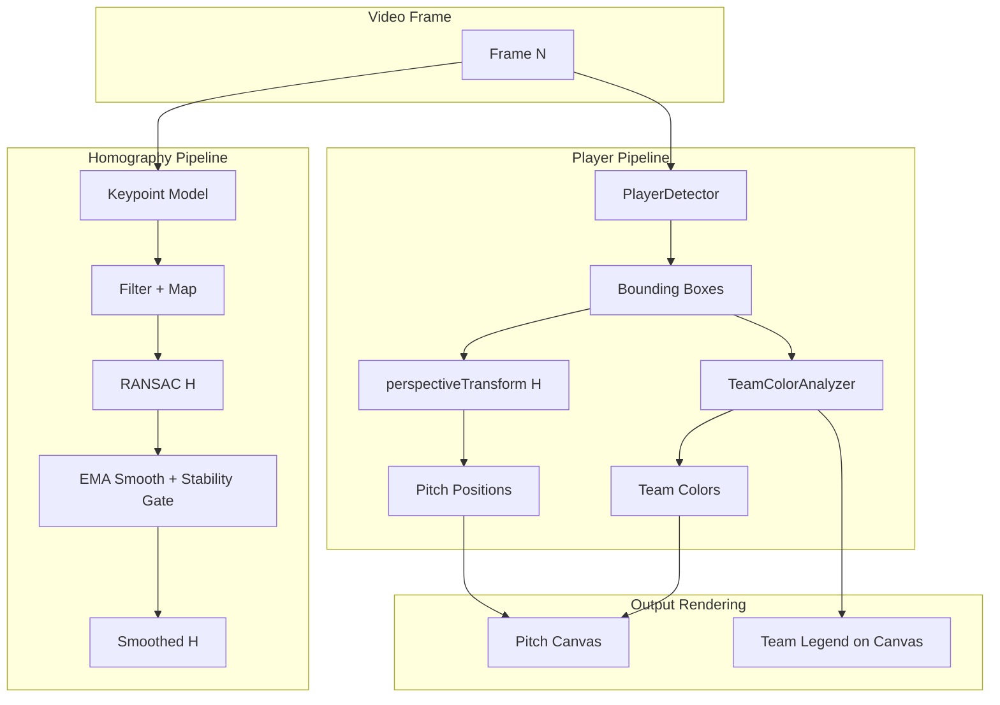
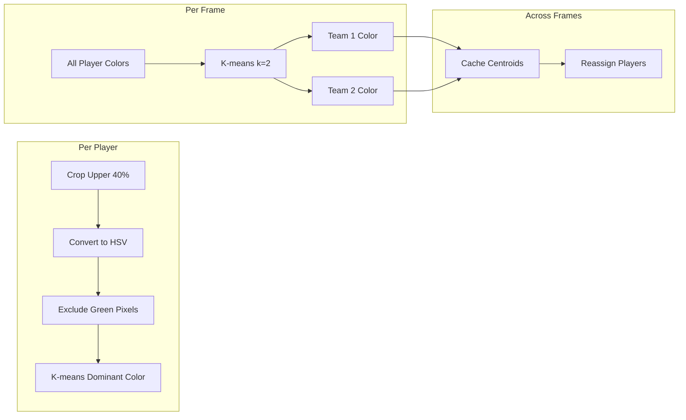

# Plan: Video Smoothing & Team Color Analysis

## Overview

Two feature requests:
1. **Smoothing** — Reduce shakiness/jitter in the `full_pitch_debug_map.mp4` video caused by frame-to-frame homography instability
2. **Team Color Analysis** — Segregate players into teams based on jersey colors and display those colors on the pitch canvas and annotated frames

---

## Part 1: Video Smoothing

### Root Cause Analysis

The `full_pitch_debug_map.mp4` video is jerky because:

1. **Per-frame homography recomputation**: [`KeypointHomographyComputer.compute_homography()`](app/keypoint_service.py:292) computes a fresh H via RANSAC each frame. Even with similar keypoints, RANSAC can produce slightly different H matrices due to random sampling, especially when inlier sets differ.

2. **Mode switching**: The pipeline alternates between `keypoint-ransac` (new H computed) and `fallback-last` (reusing previous H). See demo output showing this pattern at frames 29→59→89→119→149.

3. **No temporal coherence**: Currently, each frame is processed independently. The `last_H` fallback is binary (use or don't use) — there's no blending or interpolation between H matrices.

4. **Direct H application**: Player positions are directly computed from the per-frame H: [`cv2.perspectiveTransform(bottom_center, H)`](app/player_service.py:48). Any H instability directly translates to player position jumps on the pitch canvas.

### Proposed Smoothing Strategy: Three-Layer Approach

#### Layer 1: Homography Temporal Smoothing (EMA)

Apply an **Exponential Moving Average** to the homography matrix elements to smooth transitions between frames.

```
H_smooth = alpha * H_new + (1 - alpha) * H_smooth_prev
```

- **alpha = 0.3**: Aggressive smoothing (very stable, but may lag behind real camera motion)
- **alpha = 0.6**: Moderate smoothing (good balance)
- **alpha controlled by `SMOOTHING_ALPHA` constant**

**Location**: Modify [`KeypointHomographyComputer.compute_homography()`](app/keypoint_service.py:292) to store and return a smoothed H.

**Implementation**:
```python
# In KeypointHomographyComputer.__init__
self.smoothed_H = None
self.smoothing_alpha = SMOOTHING_ALPHA  # e.g., 0.5

# In compute_homography, after getting raw H
if self.smoothed_H is not None and raw_H is not None:
    H = self.smoothing_alpha * raw_H + (1 - self.smoothing_alpha) * self.smoothed_H
    # Re-normalize H[2,2] to 1.0
    H = H / H[2, 2]
elif raw_H is not None:
    H = raw_H
    self.smoothed_H = H
else:
    H = None
```

**Risk**: EMA on H elements directly can theoretically produce a non-homography matrix, but for small changes between frames, the linear interpolation is a good approximation. Re-normalizing H[2,2]=1 keeps it valid.

#### Layer 2: Homography Stability Gate

Only accept a newly computed H if it doesn't deviate **too much** from the previous smoothed H. This prevents large jumps when RANSAC produces an outlier.

**Metric**: Compute the **Frobenius norm** of (H_new - H_smoothed_prev) / ||H_smoothed_prev||.

```python
if self.smoothed_H is not None and raw_H is not None:
    diff_norm = np.linalg.norm(raw_H - self.smoothed_H) / np.linalg.norm(self.smoothed_H)
    if diff_norm > H_STABILITY_THRESHOLD:  # e.g., 0.15
        # Reject: use smoothed_H instead
        raw_H = None
```

**Location**: [`KeypointHomographyComputer`](app/keypoint_service.py:146), new method or inline in `compute_homography`.

#### Layer 3: Player Position Temporal Smoothing (post-projection, optional)

Apply a lightweight Kalman-filter-like smoothing to **individual player pitch positions** across frames. This smooths the rendering even if H is stable but player detections flicker (e.g., detection on/off between frames).

**Approach**: Simple 1€ Filter (One-Euro Filter) or per-player EMA of pitch coordinates.

**Location**: In [`KeypointPipeline.process_frame()`](app/keypoint_pipeline.py:73) or in [`PitchArtist.draw_players_on_pitch()`](app/pitch.py:78).

Since this requires player tracking (matching players across frames), it's more complex. **Recommend deferring this for now** and focusing on Layer 1 + Layer 2.

#### Layer 4 (Alternative): Frame Interpolation for Output

If H changes significantly at a frame boundary, write **duplicate frames** with intermediate player positions to smooth the visual transition. This reduces perceived shakiness but lowers the effective framerate of movement.

**Approach**: 
- When the smoothed H changes by more than a threshold between consecutive frames, generate and write 1-2 intermediate frames by interpolating between `H_prev` and `H_current`
- Interpolate player positions linearly between frames

**Location**: In [`KeypointPipeline.process_video()`](app/keypoint_pipeline.py:297).

This is more complex and may cause motion blur artifacts. **Defer unless needed**.

### Recommended Approach (Minimum Viable)

**Implement Layer 1 (EMA smoothing) + Layer 2 (stability gate) in [`app/keypoint_service.py`](app/keypoint_service.py)**. These are the most impactful changes with minimal code complexity.

### New Constants

Add to [`app/constants.py`](app/constants.py):
```python
# Homography smoothing
SMOOTHING_ALPHA = 0.4       # EMA smoothing factor (0.0=no smoothing, 1.0=full instant update)
H_STABILITY_THRESHOLD = 0.2  # Maximum relative Frobenius norm change to accept new H
```

---

## Part 2: Team Color Analysis

### Current State

- [`PlayerDetector`](app/player_service.py:5) detects players and returns bounding boxes but does **no color analysis**
- All players on the pitch canvas are rendered as **red dots** via [`PitchArtist.draw_players_on_pitch()`](app/pitch.py:78)
- The player detection model currently removes "ball" and "other" classes but doesn't distinguish teams

### Design

#### Step 1: Extract Player Jersey Colors

For each detected player bounding box:
1. Extract the **upper 40%** of the bounding box region (where jersey is visible, avoiding shorts/socks)
2. Convert to HSV color space for better color clustering
3. Apply a **mask to exclude green pixels** (pitch background) using HSV thresholds
4. Get dominant colors via K-means clustering (k=2 or 3)

**New class** `TeamColorAnalyzer` in a new file [`app/team_analyzer.py`](app/team_analyzer.py):

```python
class TeamColorAnalyzer:
    def __init__(self, n_clusters=2):
        self.n_clusters = n_clusters  # 2 teams
        self.team_colors = {}  # team_id -> BGR color tuple
    
    def extract_dominant_color(self, frame, bbox):
        """Extract dominant jersey color from player bbox."""
        x1, y1, x2, y2 = map(int, bbox)
        h, w = y2 - y1, x2 - x1
        # Upper 40% for jersey
        jersey_roi = frame[y1:y1 + int(h * 0.4), x1:x2]
        # ... extract and return dominant color
    
    def assign_teams(self, player_colors):
        """Cluster players into teams based on dominant colors."""
        # K-means clustering on HSV colors
        # Return team_id for each player + team colors
```

**Location**: New file [`app/team_analyzer.py`](app/team_analyzer.py).

#### Step 2: Cluster Players into Teams

- Use **K-means (k=2)** on the extracted dominant HSV colors
- The two centroids represent the two teams
- **Goalkeeper detection**: A player whose color is significantly different from both team centroids (or whose position is near the goal) is flagged as a goalkeeper
- **Referee detection**: Striped/black/white colors that don't match either team

**Clustering approach**:
```python
from sklearn.cluster import KMeans

# player_colors is list of HSV tuples
kmeans = KMeans(n_clusters=2, random_state=0).fit(player_colors)
team_labels = kmeans.labels_
team_center_colors = kmeans.cluster_centers_
```

#### Step 3: Display Team Colors on Outputs

**Pitch Canvas** ([`PitchArtist.draw_players_on_pitch()`](app/pitch.py:78)):
- Modify to accept `colors` list (one color per player)
- Draw player dots using their team color instead of all-red
- Team 1 colors on one set of player dots, Team 2 on another

**Annotated Frame** ([`_draw_keypoints_on_frame()`](app/keypoint_pipeline.py:223)):
- Draw colored bounding boxes around players (team color)
- Add team color legend on the frame

**Deep Analysis Frame**:
- Similarly color-code players on segmentation overlay

#### Step 4: Cache Team Assignments

Since team colors don't change across frames in a match, cache the team color centroids and assignment after the first frame. This ensures consistent coloring throughout the video.

**Implementation**: 
- On the first frame where both teams are detected, compute and cache centroids
- On subsequent frames, assign each player to the nearest cached centroid
- Re-compute every N frames (e.g., 100) to handle lighting changes

### Files to Create/Modify

#### New file: [`app/team_analyzer.py`](app/team_analyzer.py)
- `TeamColorAnalyzer` class with color extraction and team assignment logic
- Constants for HSV thresholds (green exclusion, jersey region ratio)

#### Modify: [`app/player_service.py`](app/player_service.py)
- Add method `extract_player_crops(frame, xyxy)` to get cropped player regions
- Return both bounding boxes and cropped images for color analysis

#### Modify: [`app/pitch.py`](app/pitch.py)
- Update `draw_players_on_pitch()` to accept `team_colors` list
- Color player dots by team

#### Modify: [`app/keypoint_pipeline.py`](app/keypoint_pipeline.py)
- Import and initialize `TeamColorAnalyzer`
- In `process_frame()`, after player detection, extract colors and assign teams
- Pass team colors to `PitchArtist.draw_players_on_pitch()` output
- Draw team-colored annotations on frames

#### Modify: [`app/keypoint_pipeline.py`](app/keypoint_pipeline.py) — `process_video()`
- Add team color legend overlay on the pitch canvas
- Show team color swatches and labels in a corner

#### Modify: [`app/constants.py`](app/constants.py)
- Add team color-related constants (HSV thresholds, jersey ratio, etc.)

---

## Architecture Diagram



## Flow for Color Analysis



## Implementation Order

1. **Smoothing changes first** (lower risk, clearer impact):
   - Add `SMOOTHING_ALPHA` and `H_STABILITY_THRESHOLD` to [`app/constants.py`](app/constants.py)
   - Add smoothing state + logic to [`KeypointHomographyComputer`](app/keypoint_service.py:146)
   - Update `compute_homography()` to return smoothed H

2. **Team color analysis** (higher complexity):
   - Create [`app/team_analyzer.py`](app/team_analyzer.py) with `TeamColorAnalyzer` class
   - Add color extraction + K-means clustering
   - Integrate into pipeline: modify [`app/keypoint_pipeline.py`](app/keypoint_pipeline.py) `process_frame()`
   - Update [`app/pitch.py`](app/pitch.py) `draw_players_on_pitch()` to use team colors
   - Add team color legend to output frames

---

## Risks and Mitigations

| Risk | Likelihood | Mitigation |
|------|-----------|------------|
| EMA smoothing causes visible lag in player movement | Medium | Tune alpha; try adaptive alpha based on confidence |
| Color analysis fails in poor lighting | Medium | Use HSV for lighting invariance; normalize colors |
| Goalkeeper colors merged into team | Low | Detect by goal proximity or color distance > 2x std |
| Referee colors misclassified as team | Low | Black/white/gray pixels have low saturation; detect and exclude |
| Performance hit from color extraction | Low-Medium | Only analyze non-overlapping upper-jersey crops; process every N frames for clustering |
